# iOS Keyboard Types

Here is a list of screenshots of available keyboards on iOS 9.3.

###`default`
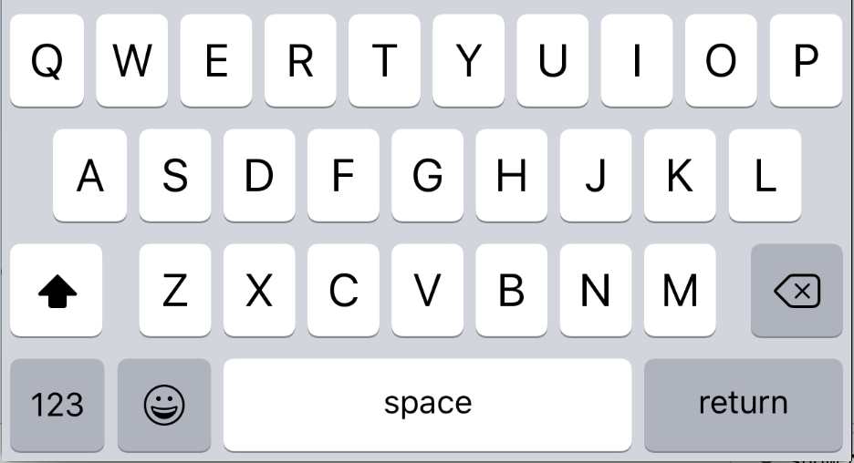

###`numeric`
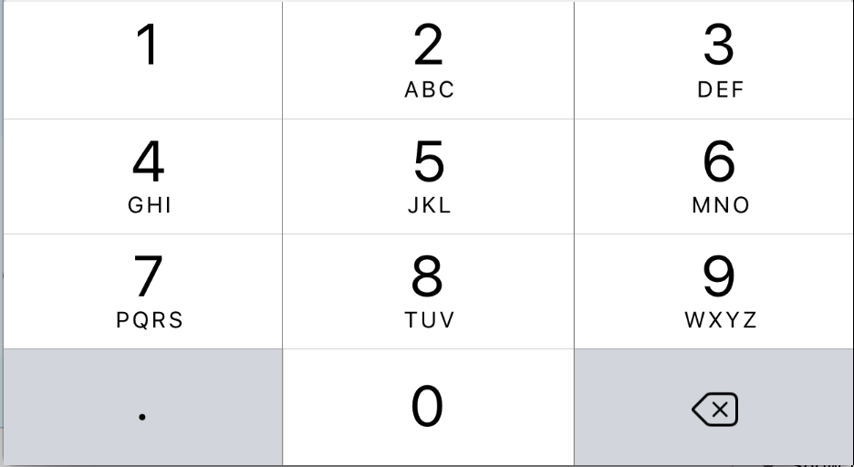

###`email-address`
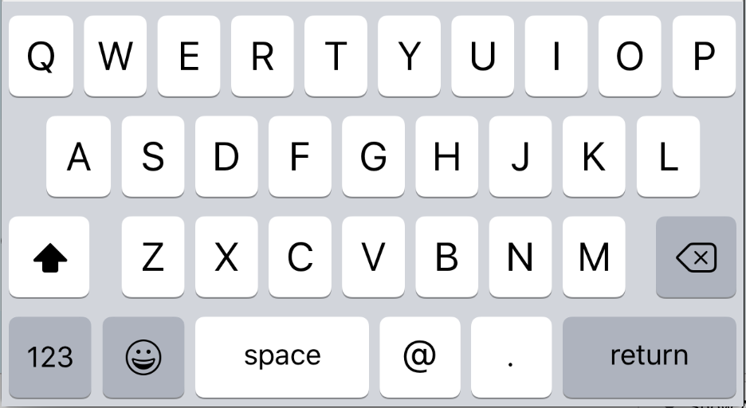

###`phone-pad`
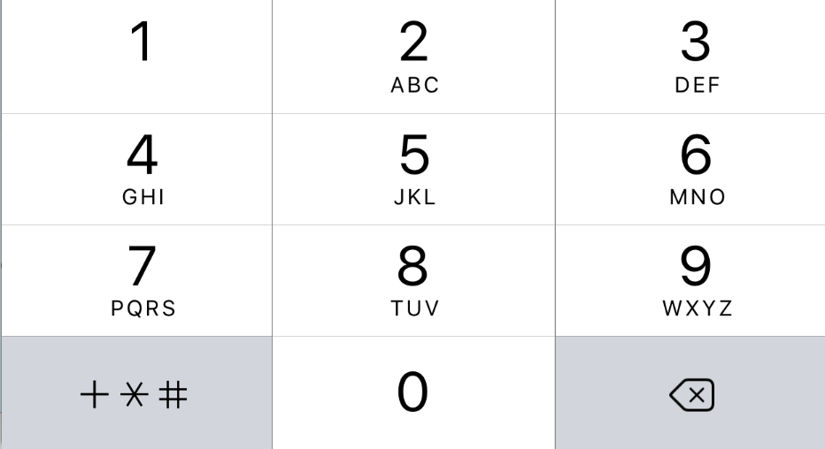

###`ascii-capable`
/Users/thekevinscott/Desktop/ascii-capable.png
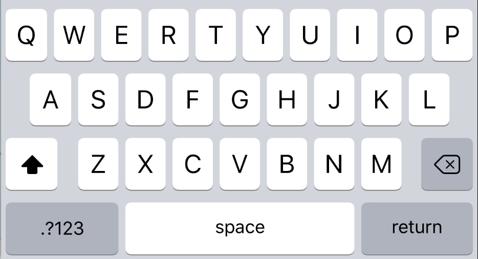

###`numbers-and-punctuation`
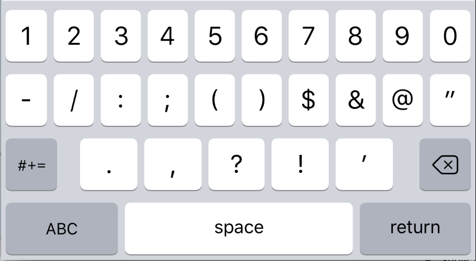

###`url`
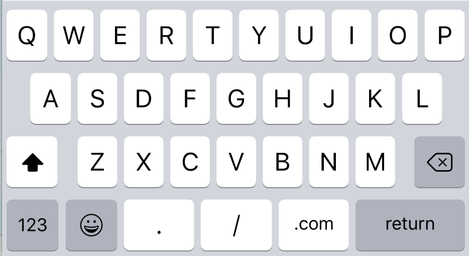

###`number-pad`
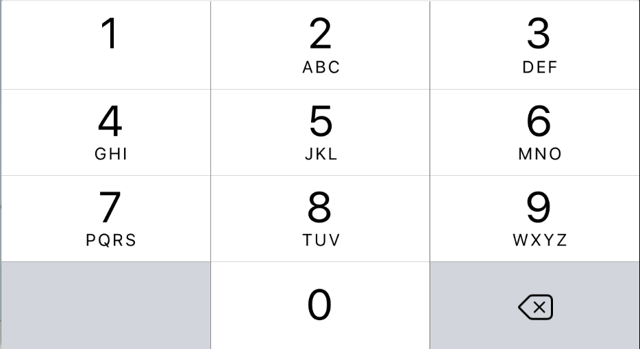

###`name-phone-pad`
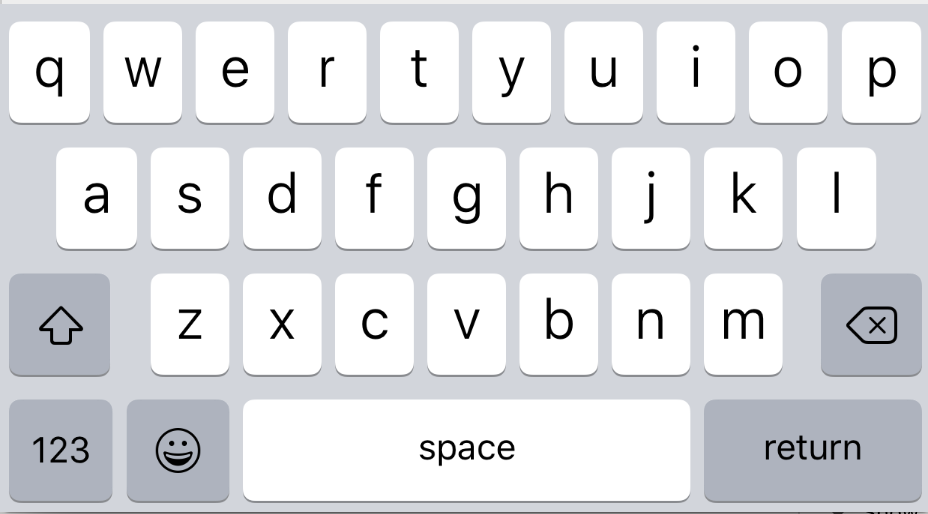

###`decimal-pad`
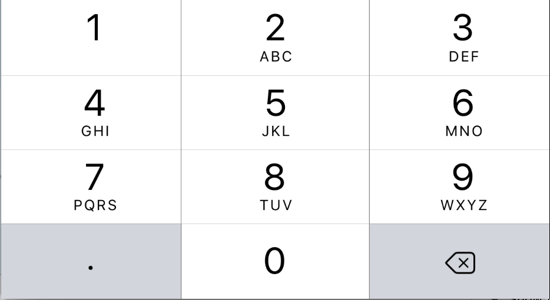

###`twitter`
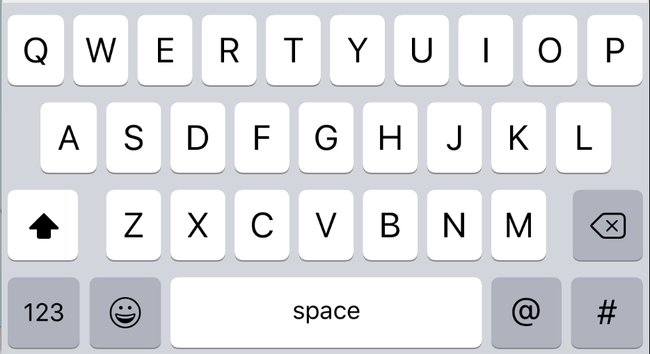

###`web-search`
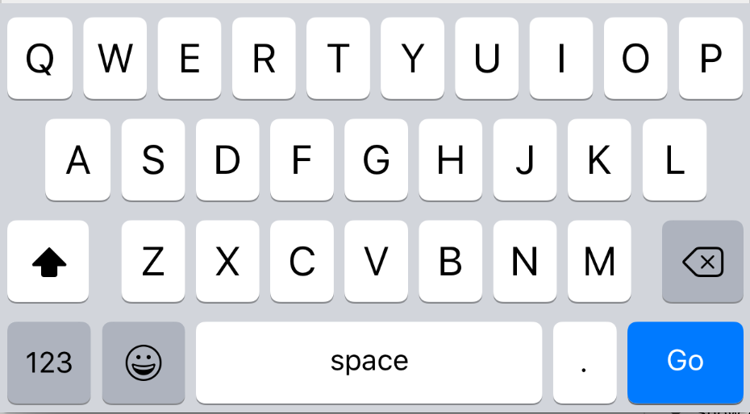
